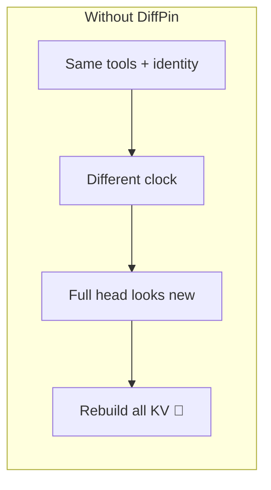
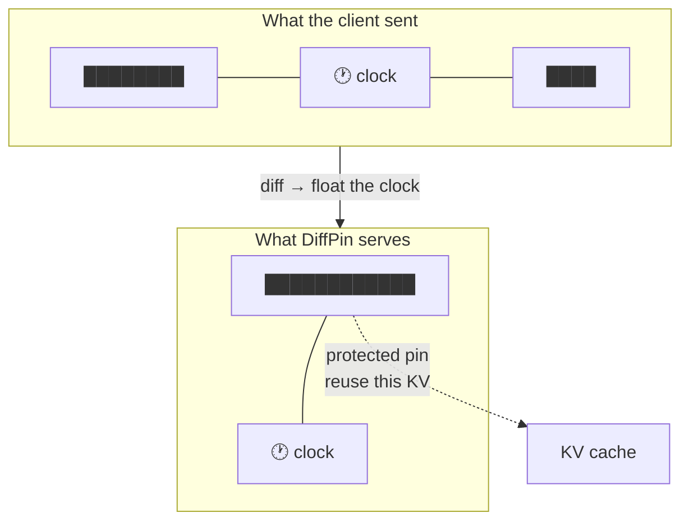
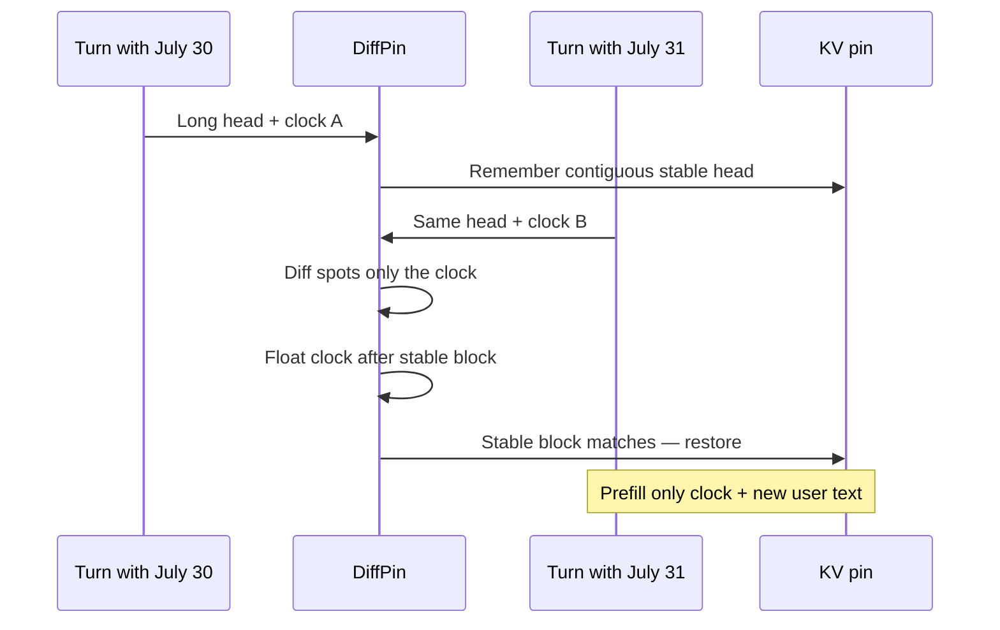
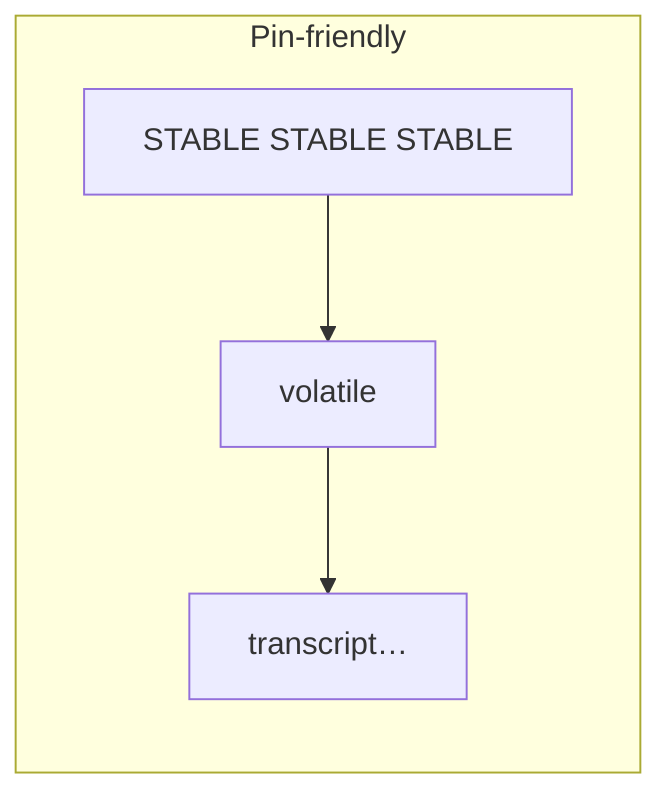
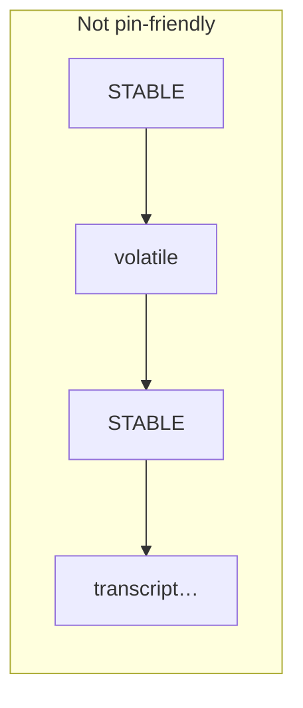
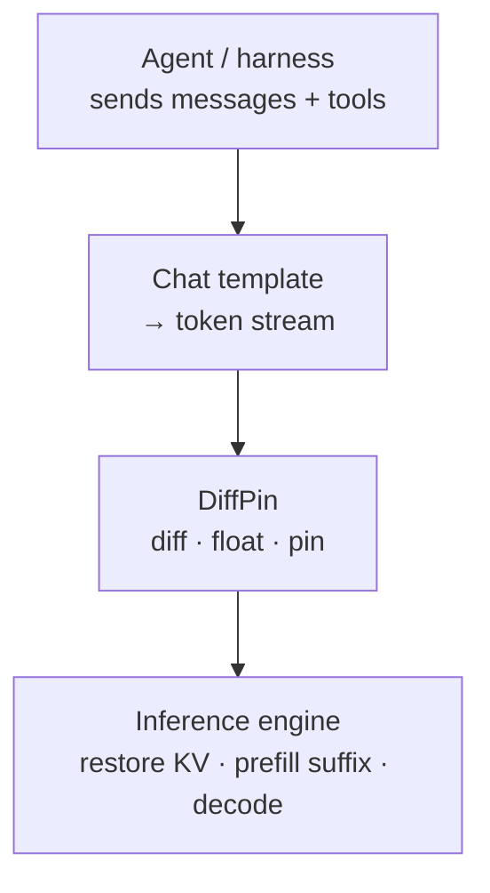
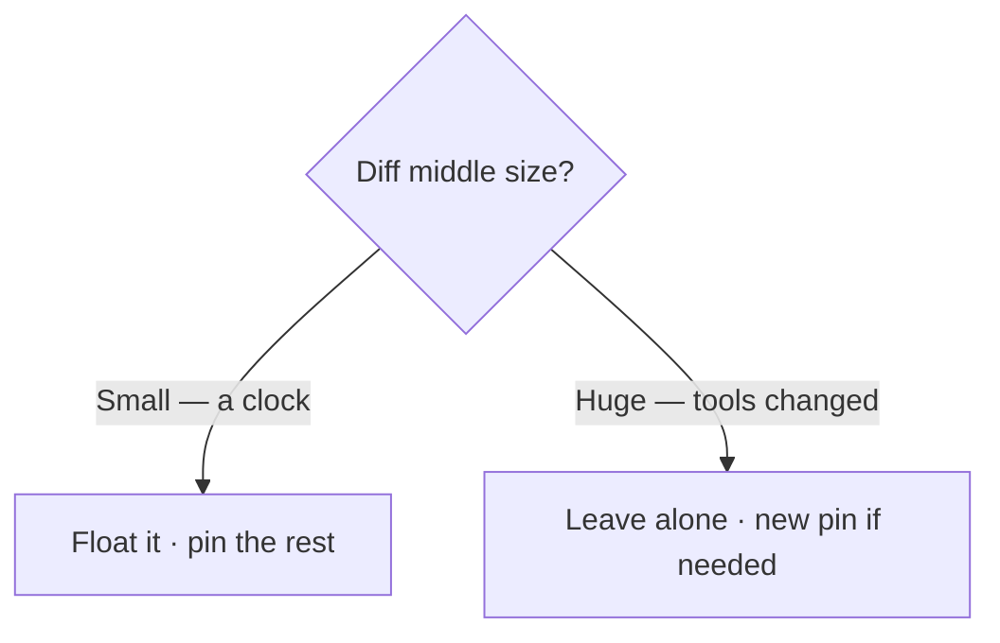
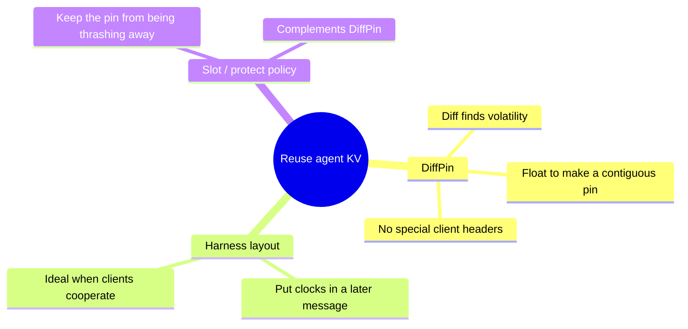
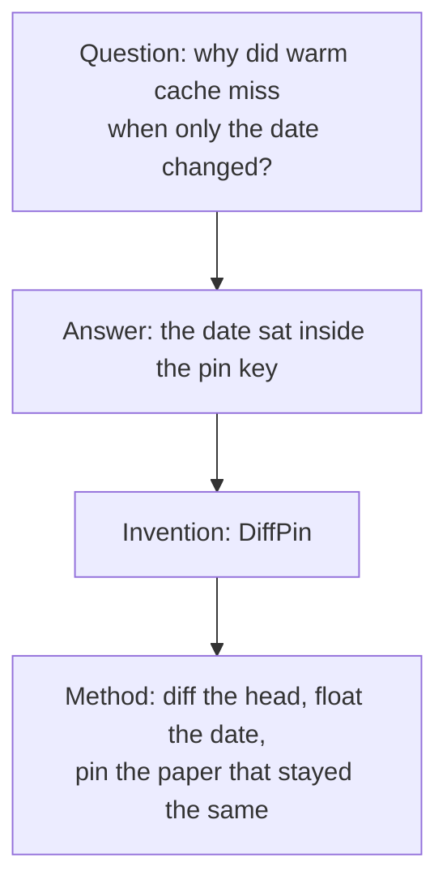

# DiffPin

**Making agent prompts prefix-cacheable by floating volatility out of the stable head**

---

## In one sentence

**DiffPin** finds the small changing part of a long prompt (a session clock, a banner, a one-line header), moves it *after* everything that stayed the same, and tells the inference engine: *pin the KV cache here — this contiguous block will come back*.

---

## Why this exists

Modern agents send a huge head on every turn: identity, rules, dozens of tool schemas. That head is expensive to **prefill** — the model must write a **KV cache** (the memory of “what I already saw”) before it can answer.

Most of that head does not change. A few tokens do — often a line like *Conversation started: Friday, July 31…*.

Prefix caching only works when the **beginning** of the prompt matches exactly. One changed date in the middle of the head, and the engine treats the whole head as new. You pay the long prefill again.



The waste is not “bad networking.” It is **throwing away valid KV** because a tiny volatile island sat where the pin key could not ignore it.

---

## The invention: DiffPin

**Name:** DiffPin  
**Idea:** Treat volatility as a *diff hunk*, not as fate.

Compare today’s tools/system head to recent traffic. The shared parts form a **prefix** and a **suffix**. The disagreement is a small **middle** (the clock). DiffPin rewrites the head so stable tokens become one contiguous block, with the volatile middle after them:

```text
Before:  [ stable … TIME … stable … ]
After:   [ stable ……… stable ][ TIME ][ end ]
              ↑ pin here
```



Same information. Better *shape* for caching.

---

## How to picture it

Think of a highlighter and a sticky note.

1. **Diff** — lay two prompts side by side; highlight what matches from the left and from the right; the unhighlighted island is the sticky note (time, model line, …).
2. **Float** — peel the sticky note off the middle and place it after the highlighted paper.
3. **Pin** — stack the highlighted paper in the KV closet. Next time the sticky note says a different day, the paper still matches.



---

## What “pin-friendly” means

A layout is **pin-friendly** when the tokens you want to reuse form one uninterrupted prefix:



Not pin-friendly when volatility punches a hole in the middle — the shared suffix cannot join the pin, because prefix caches only care about *beginnings*:



DiffPin’s job is to turn the second shape into the first.

---

## Where it sits in the story



DiffPin does not invent a new chat API. It does not need a conversation-id header. It works from **tokens the engine already has**, plus a short memory of recent tool-bearing heads.

---

## What it is careful about

DiffPin only floats a middle hunk when that hunk looks like **ephemeral noise** (small). If the tools themselves changed, the “middle” is huge — DiffPin leaves the prompt alone. Wrong merges would be worse than a cold prefill.



End-of-message markers (the “this turn is over” tokens) stay at the end of the head so the chat shape still reads as a coherent system turn.

The rewrite head stops at the **first end-of-message marker**, not at the PrefixCache chat boundary. Those boundaries sit *after* the next role-start; cutting there would let a floated middle cross into the user turn. With no chat boundaries (custom templates), DiffPin does not rewrite.

---

## What you should feel in production

| Moment | Without DiffPin | With DiffPin |
|---|---|---|
| First tool-heavy turn | Pay for the long head | Same — fill the pin once |
| Next turn, same tools, new clock | Pay for the long head again | Restore pin; prefill clock + new text |
| Multi-chat noise | Long head may get evicted | Protected pin prefers to stay |

The win is wall-clock and GPU time: tens of seconds of head prefill collapsing to a short suffix prefill when the stable block hits.

---

## Relation to other ideas



DiffPin is the engine-side invention when clients bury clocks inside one big system blob. A disciplined harness still helps; DiffPin is the safety net that makes the common messy case pin-friendly anyway.

---

## Naming

| Term | Meaning |
|---|---|
| **DiffPin** | The invention: diff → float volatility → pin contiguous stable prefix |
| **Pin** | The KV snapshot of that stable prefix |
| **Float** | Moving the volatile hunk after the stable block |
| **Pin-friendly** | Stable tokens form one uninterrupted prefix |

---

## Closing picture



Agents will keep sending large, almost-stable prompts. DiffPin makes “almost” good enough for KV reuse — by shaping the prompt so the cache can see the stability that was there all along.
